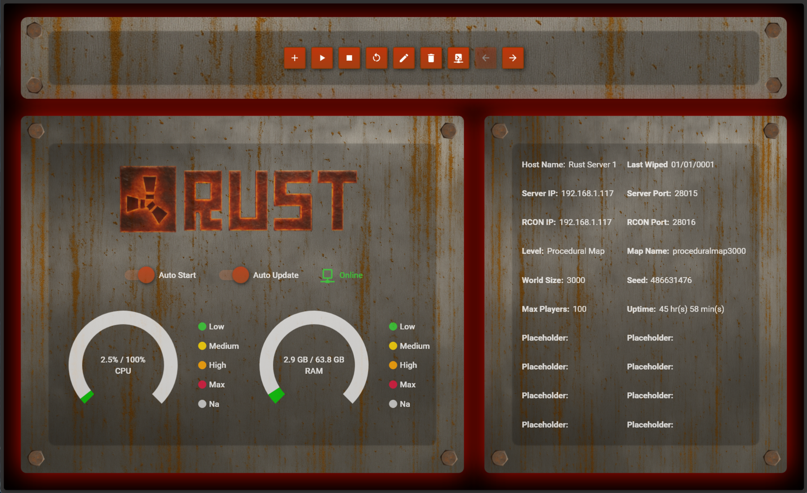

# 🔧 Rust Server Manager

A free and open-source desktop tool to monitor, manage, and control Rust servers — with a modern forge-inspired UI and real-time data.

---

## 🚀 Features

- 🔥 **Rust-Themed UI** with molten glow and lava-styled panels
- 📈 **Live CPU, RAM usage charts**
- 💬 **RCON Console** built-in for sending commands and reading logs needs some help :)
- 🎛️ **Plugin manager** to enable/disable and deploy Oxide plugins
- 📊 **Player stats tracking** (kills, uptime, inventory, and more) are on the way
- ♻️ **Multi-instance server management**
- ⚙️ **Startup config, auto-restart, and backup support**
- ☁️ **MySQL-backed server + player data**

---

## 📦 Installation

1. Clone the repo or download the latest [release](https://github.com/remathes/RustServerManager/releases)
2. Open `RustServerManager.sln` in Visual Studio 2022+
3. Build and run

> Requires **.NET 8**

---

## 🧪 In Development

- 🔄 Remote control panel for web access
- 🌍 Live Rust map viewer
- 🎯 Plugin sandbox deployment
- 🔔 Discord or RingCentral alerts
- 🔒 Secure credentials encryption

---

## 🤝 Contributing

PRs welcome! Check out the [Projects tab](https://github.com/remathes/RustServerManager/projects) and Issues to get started.

---

## ☕ Support
- I am a novice program type person. I have messed around with
- code for 20 years but still don't understand a lot but I can
- make my way around to get things working. Also 75% of this was
- built from Chatgpt so if it looks odd/off it is because well its
- AI and my limited knowledge working together with concepts and
- ideas. Feel free do download mess around or what ever!
- ⭐ Star the repo
- 💬 Share it with other server admins

---

## 📜 License

MIT — free for personal and commercial use.
